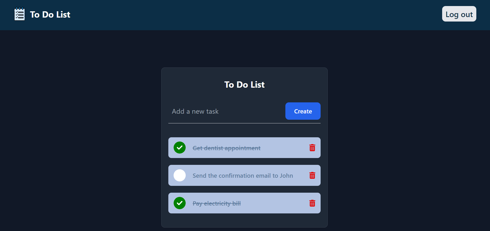

# ToDoList
A full stack website that helps users with keeping track of to-dos tasks.
It supports user authentication and authorization, create, read, update and delete todos tasks.

## Istallation
1. Clone the repository
```bash
        git clone https://github.com/AhmadHoseiny/ToDoList.git
```
2. Set up your MySQL database credentials in `backend/.env.example` file and then rename it to `backend/.env`
3. Install backend dependencies
```bash
        cd backend
        npm install
```
4. Install frontend dependencies
```bash
        cd frontend
        npm install
```
5. Run backend server
```bash
        php artisan serve
```
6. Run frontend server and use the provided URL to access the website
```bash
        npm run dev
```

## Sample Screenshot
#  

## Tools
- [PHP](https://www.php.net/)
- [Laravel](https://laravel.com/)
- [Vue.js](https://vuejs.org/)
- [tailwindcss](https://tailwindcss.com/)
- [MySQL](https://www.mysql.com/)
- [Git](https://git-scm.com/)
- [vscode](https://code.visualstudio.com/)